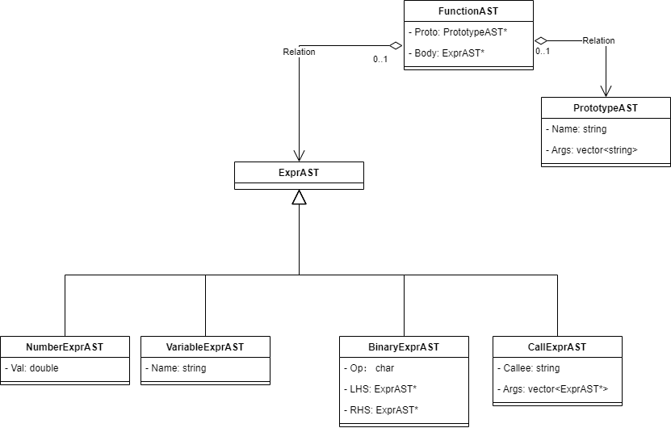

# Kaleidoscope


## AST(Abstract Syntax Tree) 抽象语法树

基本上语言中的每种结构都与一种AST对象相对应。Kaleidoscope语言中的语法结构包括表达式、函数原型和函数对象。



对于“x+y”表达式，产生的AST代码表示为

```C++
ExprAST* x = new VariableExprAST("x");
ExprAST* y = new VariableExprAST("y");
ExprAST* res = new BinaryExprAST("+", x, y);
```

## Lexer 词法分析器

定义一个CurTok变量来记录当前待解析的token，即是一个token缓冲，预先读取的下一个要处理的token；
```static int CurTok;```

## Parser 解析器

### 递归下降解析器

解析函数不仅要消费所有与当前生成规则（production）相关的所有token，还要把下一个待解析的token放进词法分析器的token缓冲区（Kaleidoscope中是CurTok变量，这个CurTok与当前的生成规则无关）

### 运算符优先级解析

利用二元运算符的优先级来引导递归调用走向的技术，因此需要定义一个运算符优先级表。

```c++
BinopPrecedence['<'] = 10;
BinopPrecedence['+'] = 20;
BinopPrecedence['-'] = 20;
BinopPrecedence['*'] = 40;  // 最高优先级
```

基本思想是通过拆解含有二元运算符的表达式来解决可能的二义性问题。

## LLVM Codegen

每种AST节点的Codegen方法负责生成该类型AST节点的IR代码及其他信息，生成的内容以Value类型对象的形式返回。LLVM用Value类标识静态单赋值（SSA）
